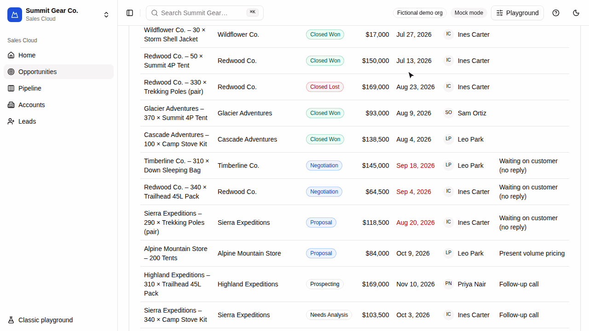

# DCI: Direct Contextual Intelligence

**Point, don't describe.** DCI lets people select parts of a web app with **Alt+Click** and use
exactly those things as context for an AI conversation, instead of describing them in words.

[](https://github.com/samirdamle/dci/actions/workflows/ci.yml)
[](https://www.npmjs.com/package/@samirdamle/dci-core)
&nbsp;**Live demo:** https://samirdamle.github.io/dci/



> **Status:** v1.0.0 is on npm. Start with [Getting started](docs/getting-started.md).

## Why

AI assistants inside apps make people **describe** what they mean: "the third row in the invoices
table, the one for Acme, not the other Acme…". That's slow, ambiguous and lossy: the model gets a
guess at the item, not its ID, type or data.

People already know how to **point**. With DCI:

1. You mark meaningful elements with one attribute, `data-dci`.
2. The user holds **Alt** (Option on macOS): annotated elements highlight under the pointer.
3. **Alt+Click** selects a row, a card, a chart point. **Alt+Shift+Click** or **Alt+Drag** selects
   several.
4. They ask. Your backend receives the question **plus the exact records selected**: their IDs,
   types, data and where they sit on the page.

|                         | Typing a description       | Pointing with DCI                             |
| ----------------------- | -------------------------- | --------------------------------------------- |
| Identifying the target  | A sentence or two per item | One click per item                            |
| Accuracy                | Depends on wording         | Exact: stable IDs from the app                |
| What the model receives | Prose it has to interpret  | Structured JSON (`id`, `type`, data, path)    |
| Multiple items          | Gets harder with each one  | Shift+Click, drag a box, or select same-type  |
| Data sent               | Whatever the user pastes   | Only annotated payloads the developer exposed |

DCI is framework-agnostic and headless-first (plain TypeScript, thin React bindings, every UI part
replaceable), backend-agnostic (a small documented protocol; plain LLM calls or full agents), and
two-way: the agent can update the page through **client actions**.

## Quick start

```sh
npm install @samirdamle/dci-react @samirdamle/dci-server
```

```tsx
import type { DciConfig } from '@samirdamle/dci-core';
import { dci, DciProvider } from '@samirdamle/dci-react';

const config: DciConfig = { endpoint: '/api/dci' };

export const App = () => (
  <DciProvider config={config}>
    <article {...dci({ id: 'inv_123', type: 'invoice', label: 'Invoice #123', status: 'overdue' })}>
      Invoice #123 · $420 · overdue
    </article>
  </DciProvider>
);
```

```ts
import { dciHandler, formatContextForPrompt } from '@samirdamle/dci-server';

/** Placeholder model: replace the body with a call to your LLM or agent. */
async function* callModel(prompt: string, context: string): AsyncIterable<string> {
  yield `Context (${context.length} characters) and prompt ("${prompt}") passed on to model.\n\n`;
  yield 'Analysis of the context sent back from model.';
}

export const POST = dciHandler(async (req, stream) => {
  const context = formatContextForPrompt(req.context); // the selected items, ready for a prompt
  // Call your model here, and stream its reply back as it arrives.
  for await (const text of callModel(req.prompt, context)) stream.text(text);
});
```

Not using React? `createDci({ endpoint: '/api/dci' })` from `@samirdamle/dci-core` does the same.
[Getting started](docs/getting-started.md) walks through a full setup with Claude.

## Documentation

| Guide                                                  | What's in it                                                             |
| ------------------------------------------------------ | ------------------------------------------------------------------------ |
| [Getting started](docs/getting-started.md)             | Plain JS, React, and a minimal backend with Claude                       |
| [Annotation guide](docs/annotations.md)                | `data-dci` syntax, designing types and hierarchy, `private`, what's sent |
| [Interactions](docs/interactions.md)                   | Every gesture and key, remapping, custom gestures                        |
| [Configuration and API](docs/configuration.md)         | All options, the instance API, React hooks, theming, building blocks     |
| [Protocol](docs/protocol.md)                           | The wire format, and a backend in Python                                 |
| [Recipes](docs/recipes.md)                             | Custom transports, headless React chat, redaction, agent frameworks      |
| [Compatibility](docs/compatibility.md)                 | Browsers, OS modifier keys, CSP, shadow DOM, performance budgets         |
| [Browser extension](docs/extension.md)                 | DCI on any website: install, backends, privacy review                    |
| [API reference](https://samirdamle.github.io/dci/api/) | Generated from the TSDoc comments (`pnpm docs:api`)                      |
| [Specification](SPEC.md)                               | The v1 design                                                            |

## Packages

| Package                                         | Purpose                                                          |
| ----------------------------------------------- | ---------------------------------------------------------------- |
| [`@samirdamle/dci-core`](packages/core)         | Framework-agnostic selection engine, overlay, chat UI, transport |
| [`@samirdamle/dci-react`](packages/react)       | React bindings: `DciProvider`, hooks, `dci()`                    |
| [`@samirdamle/dci-server`](packages/server)     | Endpoint helpers for Node, Bun, Deno and edge runtimes           |
| [`@samirdamle/dci-protocol`](packages/protocol) | Wire-protocol types and the SSE encoder/decoder                  |

The [demo](https://samirdamle.github.io/dci/) (`apps/demo`) is a mock CRM for a fictional
Salesforce-style org, with a Claude-powered agent that can change records, a no-key mock mode and
a Playground to try every option live.

## Browser extension

The [DCI extension](apps/extension) (Chrome and Firefox, Manifest V3) brings DCI to websites
that were never annotated. Turn it on for a tab, hold Alt and click a table row, a price or a
paragraph, then ask. Rows become records with one field per column. Answers come from Claude
with your own API key, from your own DCI endpoint, or from an offline placeholder. Nothing is
sent until you ask, and keys never reach web pages. It isn't in the stores yet; see
[docs/extension.md](docs/extension.md) to load it unpacked.

## Privacy and security

- **Opt-in data.** Only `data-dci` payloads (and fallback details, if enabled) are ever sent, and
  only when the user sends a message.
- **`private` nodes** can't be selected and are never sent; as an ancestor they're reduced to
  `{ "private": true }`. Password values are never read.
- **No keys in the browser.** Authentication goes through your `headers` or a custom `fetch`.
- **`beforeSend`** lets you redact or enrich every request, or cancel it.
- **Model output is untrusted.** The built-in Markdown renderer builds DOM nodes (never
  `innerHTML`) and only links to `http(s)` and `mailto`.

## Roadmap

| Milestone | Scope                                                                      | Status |
| --------- | -------------------------------------------------------------------------- | ------ |
| M0–M1     | Tooling; `data-dci` parsing, DCI tree, context extraction, selection       | Done   |
| M2–M3     | Every selection gesture; the Shadow DOM highlight overlay                  | Done   |
| M4–M5     | Protocol, transport, client actions, `@samirdamle/dci-server`; the chat UI | Done   |
| M6–M7     | `createDci()` and React bindings; the CRM demo with a Claude agent         | Done   |
| M8        | Cross-browser e2e, performance, docs, npm release                          | Done   |

| Extension | DCI on any website: inferred structure, Claude or your endpoint | Built; store listing next |

Next: Vue and Svelte bindings, touch support, and selecting by query ("all overdue invoices").

## Contributing

Setup, scripts and conventions are in [CONTRIBUTING.md](CONTRIBUTING.md). Please follow the
[code of conduct](CODE_OF_CONDUCT.md).

## License

MIT
