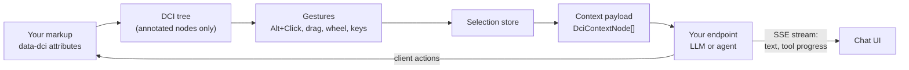

# DCI: Direct Contextual Intelligence

**Point at it, then ask.** DCI lets people select parts of a web app with **Alt+Click** and use
exactly those things as context for an AI conversation, instead of describing them in words.

[](https://github.com/samirdamle/dci/actions/workflows/ci.yml)
&nbsp;**Live demo:** https://samirdamle.github.io/dci/

> **Status:** early development. Milestones M0–M2 are done: annotation parsing, the DCI tree,
> context extraction, the selection store and every selection gesture. The overlay, chat UI,
> backend protocol and public `createDci()` API are next; see [Roadmap](#roadmap). Packages are not
> on npm yet.

---

## Contents

- [The problem](#the-problem)
- [The idea](#the-idea)
- [Why it works](#why-it-works)
- [How it feels to use](#how-it-feels-to-use)
- [How it works](#how-it-works)
- [Using DCI in your app](#using-dci-in-your-app)
- [Privacy and security](#privacy-and-security)
- [Roadmap](#roadmap)
- [Development](#development)

---

## The problem

AI assistants inside apps make people **describe** what they mean:

> "In the invoices table, the third row, the one for Acme, not the other Acme, the one from March.
> Why is it overdue?"

Describing on-screen things in words is:

- **Slow.** Users type a paragraph to identify something they can already see.
- **Ambiguous.** "The third row" depends on sorting, filters and scroll position. Names collide.
- **Lossy.** The model gets a guess at the item, not its ID, type or fields, so it has to search,
  guess or ask follow-up questions.
- **Expensive.** Pasting screenshots or whole pages to be safe burns tokens and leaks more data
  than needed.

## The idea

People already know how to **point**. DCI turns pointing into precise, structured context:

1. The developer marks meaningful elements with one attribute: `data-dci`.
2. The user holds **Alt** (Option on macOS). Annotated elements highlight under the pointer.
3. **Alt+Click** selects an element: a row, a card, a chart, a field. Add more with
   **Alt+Shift+Click**, or drag a box around several.
4. The user asks a question. The AI receives the question **plus the exact records selected**:
   their IDs, types and data, and where they sit in the page.

|                         | Typing a description       | Pointing with DCI                             |
| ----------------------- | -------------------------- | --------------------------------------------- |
| Identifying the target  | A sentence or two per item | One click per item                            |
| Accuracy                | Depends on wording         | Exact: stable IDs from the app                |
| What the model receives | Prose it has to interpret  | Structured JSON (`id`, `type`, fields, path)  |
| Multiple items          | Gets harder with each one  | Shift+Click, drag a box, or select same-type  |
| Data sent               | Whatever the user pastes   | Only annotated payloads the developer exposed |

The effect is the same as moving from typing file paths to clicking files: less effort, fewer
mistakes, and intent that is clear to the machine.

## Why it works

**Precision by construction.** The context comes from the app itself: stable IDs and typed data, not
text scraped from the screen. The model doesn't have to work out which "Acme" was meant.

**Structure, not pixels.** Each selected node carries its `type`, `label`, data and **ancestors**
(e.g. `Dashboard › Invoices › Invoice #123`), so the model knows both _what_ it is and _where_ it
is. A selected cell still knows its row and table.

**Fewer tokens, better answers.** A few hundred bytes of targeted JSON replace screenshots, page
dumps and clarifying questions.

**Developer-controlled exposure.** Only elements you annotate carry data. `private` nodes can
never be selected or sent, and a `beforeSend` hook can redact or enrich payloads (planned). Unannotated
elements are optional: with `fallback: true`, DCI describes them from visible information only.

**Backend-agnostic.** DCI sends a small, documented request and reads a streamed response. Behind
the endpoint can be a plain LLM call, an agent with tools and memory, or your existing
AI stack. API keys never go to the browser.

**Two-way.** The agent can act on the page through **client actions** (e.g. update a record,
highlight a node), so answers turn into edits the user can see (planned, M4).

**Framework-agnostic, headless-first.** The core is plain TypeScript with no framework
dependency. React bindings are thin, and every UI piece can be replaced (planned, M5–M6).

## How it feels to use

DCI stays out of the way until the modifier is held. Without the modifier, clicks, scrolling and
keys behave exactly as the app intends.

### Mouse

| Gesture                        | What it does                                                                |
| ------------------------------ | --------------------------------------------------------------------------- |
| Hold **Alt**                   | Hover preview: the DCI node under the pointer is highlighted                |
| **Alt+Click**                  | Select that node (replaces the selection)                                   |
| **Alt+Shift+Click**            | Add or remove that node                                                     |
| **Alt+Wheel**                  | Move the highlight up or down the tree before clicking (cell → row → table) |
| **Alt+Drag** left → right      | Select nodes fully inside the box                                           |
| **Alt+Drag** right → left      | Select nodes the box touches                                                |
| …with **Shift** / **Ctrl/Cmd** | Add to / subtract from the selection                                        |
| **Alt+Double-click**           | Select all siblings of the same type (e.g. every invoice row)               |

### Keyboard (while something is selected)

| Key               | What it does                                      |
| ----------------- | ------------------------------------------------- |
| **↑ / ↓**         | Move to the parent / first child                  |
| **← / →**         | Move to the previous / next sibling               |
| **Shift + arrow** | Extend the selection instead of moving it         |
| **Esc**           | Clear the selection (closes the chat first, once) |
| **Alt+Enter**     | Select the focused element (no mouse needed)      |

Alt+arrows are deliberately left alone, because Alt+← is the browser's Back shortcut.

### Design principles

- **Modifier-gated.** Nothing happens, and only three listeners exist, until the modifier is held.
- **Never hijacks.** Events are only swallowed when a DCI gesture actually happened.
- **Configurable.** Every binding can be remapped or turned off, including the modifier itself.
- **Accessible.** Full keyboard control and polite screen-reader announcements such as
  "Selected Invoice #2, row 2 of 20".
- **Isolated.** DCI's own UI renders in Shadow DOM and never touches your styles (from M3).

## How it works



### 1. Annotations

One attribute marks an element as selectable context. The short form is just an ID; the full form
is a JSON object.

```html
<!-- Short form: the string is the id -->
<tr data-dci="inv_123">
  …
</tr>

<!-- Full form -->
<tr
  data-dci='{"id":"inv_123","type":"invoice","label":"Invoice #123","amount":420,"status":"overdue"}'
>
  …
</tr>

<!-- Never selectable, never sent -->
<div data-dci='{"id":"ssn","private":true}'>…</div>
```

| Key       | Meaning                                                                |
| --------- | ---------------------------------------------------------------------- |
| `id`      | Stable identifier your backend understands                             |
| `type`    | Kind of node; drives "select same type" and per-type suggested actions |
| `label`   | Human-readable name for chips, breadcrumbs and announcements           |
| `private` | `true` means it can't be selected and its data is never sent           |
| _other_   | Free-form data, passed through to your backend as-is                   |

Invalid JSON falls back to the short form, with a warning in development.

### 2. The DCI tree

DCI reduces the DOM to annotated elements. Unannotated wrappers such as layout `div`s disappear,
so navigation follows _meaning_, not markup:

```text
DOM                                     DCI tree
<main data-dci="page">                  page
  <div class="grid">                    └── invoices (table)
    <table data-dci="invoices">             ├── inv_122 (invoice)
      <tbody>                               ├── inv_123 (invoice)
        <tr data-dci="inv_122">…</tr>       │   └── inv_123.amount (cell)
        <tr data-dci="inv_123">             └── inv_124 (invoice)
          <td data-dci="inv_123.amount">
        <tr data-dci="inv_124">…</tr>
```

Queries run on the live DOM (nothing is cached), so your app can re-render freely. Open shadow
roots are traversed.

### 3. The context payload

Each selected node becomes a `DciContextNode`. This is what your backend receives:

```json
{
  "id": "inv_123",
  "type": "invoice",
  "label": "Invoice #123",
  "data": { "amount": 420, "status": "overdue" },
  "ancestors": [
    { "id": "dash", "type": "page", "label": "Dashboard" },
    { "id": "inv", "type": "table", "label": "Invoices" }
  ],
  "source": "annotated"
}
```

- Ancestors are compact by default (`id`, `type`, `label`); `ancestorData: 'full'` adds their data.
- A private ancestor appears only as `{ "private": true }`.
- With `fallback: true`, an unannotated element is described from what's visible: tag, trimmed
  text, `aria-label`, `alt`, `title`, `href`, form values (**never password fields**) and a short
  CSS path. Unannotated content inside a private node is never described.

### 4. The backend protocol (planned, M4)

The client `POST`s one JSON request to your endpoint:

```json
{
  "sessionId": "…",
  "prompt": "Why is this overdue?",
  "action": "explain",
  "context": [/* DciContextNode[] */],
  "page": { "url": "…", "title": "…" }
}
```

and reads a Server-Sent Events stream back:

| Event           | Payload                | Used for                       |
| --------------- | ---------------------- | ------------------------------ |
| `text-delta`    | `{ text }`             | Streaming the answer           |
| `tool-start`    | `{ id, name, label? }` | "Updating invoice…" progress   |
| `tool-end`      | `{ id, ok, label? }`   | Tool finished                  |
| `client-action` | `{ name, args }`       | The agent asks the page to act |
| `error`         | `{ message, code? }`   | Errors                         |
| `done`          | `{}`                   | End of the response            |

`@dci/server` will provide helpers to parse the request and stream these events from Node.

## Using DCI in your app

### Step 1: annotate what matters

Start with the things users talk about: records (rows, cards), their key fields, and the
containers that give them meaning (tables, pages). You don't need to annotate everything.
Unannotated elements can still be selected with `fallback: true`.

```tsx
<table data-dci={JSON.stringify({ id: 'invoices', type: 'table', label: 'Invoices' })}>
  {invoices.map((inv) => (
    <tr
      key={inv.id}
      data-dci={JSON.stringify({
        id: inv.id,
        type: 'invoice',
        label: `Invoice ${inv.number}`,
        status: inv.status,
      })}
    >
      …
    </tr>
  ))}
</table>
```

**Tips:** use IDs your backend can look up; give each kind of thing a `type` (that's what powers
"select all invoices" and per-type actions); put only what the model needs in the payload; mark
anything sensitive `private`.

### Step 2: turn on interactions (available now)

`@dci/core` exposes the pieces built so far. `createInteractions` wires the modifier, gestures,
DCI tree and selection store together:

```ts
import { createInteractions } from '@dci/core';

const dci = createInteractions({
  root: document.querySelector('#app')!, // default: document.body
  modifier: 'Alt', // 'Alt' | 'Shift' | 'Control' | 'Meta'
  maxSelection: 50,
  fallback: true, // allow unannotated elements
  includeAncestors: true,
  bindings: {
    windowSelect: true,
    keyboard: { selectFocused: 'Alt+Enter' }, // any key can be remapped or set to false
  },
});

// React to selection changes
dci.selection.subscribe(({ elements, added, removed, primary }) => {
  console.log('selected', elements.length, 'primary', primary);
});

// Build the payload for your backend
const context = dci.selection.toContext(); // DciContextNode[]

// State for your own highlight UI (until the built-in overlay lands in M3)
dci.bus.on('hover', ({ node, depth }) => {
  /* highlight node */
});
dci.bus.on('marquee', (box) => {
  /* draw box?.rect, or hide when null */
});

// Clean up
dci.destroy();
```

The lower-level building blocks are exported too: `readDci`, `createDciTree`, `toContextNode`,
`createSelectionStore`, `createInputManager`, the individual gestures (`clickGesture`,
`marqueeGesture`, …), and `selectSameType`. Each gesture is a plain function
`(ctx) => cleanup`, so you can drop, replace or add your own via the `gestures` option.

### Step 3: the full API (planned, M4–M6)

The target API bundles the overlay, chat UI and transport:

```ts
import { createDci } from '@dci/core';

const dci = createDci({
  endpoint: '/api/dci',
  headers: () => ({ Authorization: `Bearer ${token}` }),
  chat: { mode: 'popover' }, // or 'panel'
  actions: {
    invoice: [{ id: 'remind', label: 'Draft reminder', prompt: 'Draft a payment reminder' }],
    '*': [{ id: 'summarize', label: 'Summarize' }],
  },
  beforeSend: (ctx) => ctx, // redact or enrich
});

dci.onAction('updateInvoice', ({ id, patch }) => store.update(id, patch));
```

```tsx
import { DciProvider, useDci } from '@dci/react';

<DciProvider config={config}>
  <App />
</DciProvider>;

const { selection, open, send } = useDci();
```

### Configuration available today

| Option              | Default         | Description                                                    |
| ------------------- | --------------- | -------------------------------------------------------------- |
| `attribute`         | `data-dci`      | Attribute that marks DCI nodes                                 |
| `root`              | `document.body` | Only nodes inside this element count                           |
| `modifier`          | `'Alt'`         | Key that arms DCI                                              |
| `bindings`          | see above       | Remap or disable any gesture or key                            |
| `maxSelection`      | `50`            | Cap on selected nodes (a `selectionlimit` event reports drops) |
| `fallback`          | `true`          | Allow selecting unannotated elements                           |
| `includeAncestors`  | `true`          | Include the ancestor chain in payloads                         |
| `ancestorData`      | `'compact'`     | `'full'` also sends ancestors' data                            |
| `maxTextLength`     | `500`           | Truncation for fallback text                                   |
| `windowSelectLevel` | `'leaf'`        | Drag selects innermost (`'leaf'`) or outermost (`'top'`) nodes |
| `clearOnEmptyClick` | `true`          | Alt+Click on empty space clears the selection                  |
| `passthroughClicks` | `false`         | Let DCI clicks also reach your app's handlers                  |
| `onEscape`          | —               | Runs before Esc clears (e.g. close your chat first)            |

## Privacy and security

- **Opt-in data.** Only `data-dci` payloads (and fallback details, if enabled) are ever sent.
- **`private` nodes** are unselectable, never extracted, and reduced to `{ private: true }` when
  they are an ancestor.
- **No password values**, ever, even with fallback on.
- **No keys in the browser.** Authentication goes through your `headers` or a custom `fetch` (M4).
- **`beforeSend`** gives you a last chance to redact or enrich (M4–M6).
- **Nothing leaves the page on its own.** Selecting is local; data is only sent when the user sends
  a message.

## Roadmap

| Milestone | Scope                                                               | Status  |
| --------- | ------------------------------------------------------------------- | ------- |
| M0        | Monorepo, tooling, CI, test harness                                 | Done    |
| M1        | `data-dci` parsing, DCI tree, context extraction, selection store   | Done    |
| M2        | Modifier, Alt+Click, Alt+Wheel, window select, same-type, keyboard  | Done    |
| M3        | Overlay: Shadow DOM highlight layer, labels, marquee                | Next    |
| M4        | `@dci/protocol`, SSE transport, client actions, `@dci/server`       | Planned |
| M5        | Chat UI: popover/panel, chips, breadcrumb, suggested actions        | Planned |
| M6        | `createDci()` public API and React bindings                         | Planned |
| M7        | Demo: a mock CRM with a Claude-powered agent and a no-key mock mode | Planned |
| M8        | Cross-browser e2e, performance, docs, npm release                   | Planned |

After v1: a browser extension that brings DCI to any website, Vue/Svelte bindings, touch support,
and selecting by query ("all overdue invoices"). The full specification is in [SPEC.md](SPEC.md).

## Development

### Packages

| Package                              | Purpose                                                          |
| ------------------------------------ | ---------------------------------------------------------------- |
| [`@dci/protocol`](packages/protocol) | Shared wire-protocol types and the SSE encoder/decoder           |
| [`@dci/core`](packages/core)         | Framework-agnostic selection engine, overlay, chat UI, transport |
| [`@dci/react`](packages/react)       | React bindings                                                   |
| [`@dci/server`](packages/server)     | Node helpers for the endpoint protocol                           |
| [`apps/demo`](apps/demo)             | Demo app (Vite + React + Tailwind v4 + shadcn/ui)                |

Dependency graph: `core → protocol`, `server → protocol`, `react → core`, `demo → react, server`.

### Setup

Requires Node 22.12+ (see `.nvmrc`) and pnpm (pinned via `packageManager`; `corepack enable` picks
it up).

```sh
nvm use
corepack enable
pnpm install
pnpm dev      # start the demo at http://localhost:5173
```

Inside the workspace, `@dci/*` packages resolve to their TypeScript sources through the
`@dci/source` export condition, so the demo, tests and typechecking never need a prior build.

### Scripts

| Script                              | What it does                                                 |
| ----------------------------------- | ------------------------------------------------------------ |
| `pnpm build`                        | Build every package (tsup: ESM + CJS + `.d.ts`) and the demo |
| `pnpm dev`                          | Run the demo dev server                                      |
| `pnpm lint`                         | ESLint (flat config, typescript-eslint)                      |
| `pnpm typecheck`                    | `tsc` across the root and every package                      |
| `pnpm format` / `pnpm format:check` | Prettier                                                     |
| `pnpm test` / `pnpm test:watch`     | Vitest unit tests                                            |
| `pnpm coverage`                     | Unit tests with V8 coverage (`coverage/`)                    |
| `pnpm e2e`                          | Playwright end-to-end tests against the demo                 |

### Testing

- **Unit tests (Vitest):** the root `vitest.config.ts` runs each package as a project. `protocol`
  and `server` use the `node` environment; `core` and `react` use `happy-dom`. Tests live in
  `packages/*/test`.
- **Core test helpers:** `packages/core/test/test-utils.ts` provides `mountFixture(html)`,
  `fakePointer(el, { altKey, shiftKey, ... })` and `fakeKey(key, mods)`. Fixtures are cleaned up
  after each test automatically.
- **E2E (Playwright):** `e2e/` runs against the demo dev server, which Playwright starts for you.
  Chromium runs by default; set `PW_ALL_BROWSERS=1` to add Firefox and WebKit (after
  `pnpm exec playwright install firefox webkit`).
- happy-dom has no layout engine, so geometry-dependent behaviour (window select, overlay
  positions) is tested in Playwright, not Vitest.

CI (`.github/workflows/ci.yml`) runs lint, typecheck, unit tests, build and e2e on every PR and on
pushes to `main`. Playwright traces are uploaded as an artifact when e2e fails. The demo is
deployed to GitHub Pages from `main` by `.github/workflows/pages.yml`.

## License

MIT
