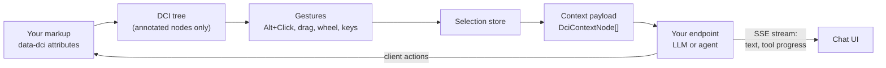

# DCI: Direct Contextual Intelligence

**Point at it, then ask.** DCI lets people select parts of a web app with **Alt+Click** and use
exactly those things as context for an AI conversation, instead of describing them in words.

[](https://github.com/samirdamle/dci/actions/workflows/ci.yml)
&nbsp;**Live demo:** https://samirdamle.github.io/dci/

> **Status:** early development. Milestones M0–M6 are done: annotation parsing, the DCI tree,
> context extraction, the selection store, every selection gesture, the highlight overlay, the
> backend protocol with its client transport and server helpers, and the chat UI. Try the whole loop
> (select, ask, watch the streamed answer) in the [live demo](https://samirdamle.github.io/dci/),
> which uses a mock backend. The one-call `createDci()` setup and the React bindings are available;
> the full CRM demo is next (see [Roadmap](#roadmap)). Packages are not on npm yet.

---

## Contents

- [The problem](#the-problem)
- [The idea](#the-idea)
- [Why it works](#why-it-works)
- [How it feels to use](#how-it-feels-to-use)
- [How it works](#how-it-works)
- [Using DCI in your app](#using-dci-in-your-app)
- [Privacy and security](#privacy-and-security)
- [Roadmap](#roadmap)
- [Development](#development)

---

## The problem

AI assistants inside apps make people **describe** what they mean:

> "In the invoices table, the third row, the one for Acme, not the other Acme, the one from March.
> Why is it overdue?"

Describing on-screen things in words is:

- **Slow.** Users type a paragraph to identify something they can already see.
- **Ambiguous.** "The third row" depends on sorting, filters and scroll position. Names collide.
- **Lossy.** The model gets a guess at the item, not its ID, type or fields, so it has to search,
  guess or ask follow-up questions.
- **Expensive.** Pasting screenshots or whole pages to be safe burns tokens and leaks more data
  than needed.

## The idea

People already know how to **point**. DCI turns pointing into precise, structured context:

1. The developer marks meaningful elements with one attribute: `data-dci`.
2. The user holds **Alt** (Option on macOS). Annotated elements highlight under the pointer.
3. **Alt+Click** selects an element: a row, a card, a chart, a field. Add more with
   **Alt+Shift+Click**, or drag a box around several.
4. The user asks a question. The AI receives the question **plus the exact records selected**:
   their IDs, types and data, and where they sit in the page.

|                         | Typing a description       | Pointing with DCI                             |
| ----------------------- | -------------------------- | --------------------------------------------- |
| Identifying the target  | A sentence or two per item | One click per item                            |
| Accuracy                | Depends on wording         | Exact: stable IDs from the app                |
| What the model receives | Prose it has to interpret  | Structured JSON (`id`, `type`, fields, path)  |
| Multiple items          | Gets harder with each one  | Shift+Click, drag a box, or select same-type  |
| Data sent               | Whatever the user pastes   | Only annotated payloads the developer exposed |

The effect is the same as moving from typing file paths to clicking files: less effort, fewer
mistakes, and intent that is clear to the machine.

## Why it works

**Precision by construction.** The context comes from the app itself: stable IDs and typed data, not
text scraped from the screen. The model doesn't have to work out which "Acme" was meant.

**Structure, not pixels.** Each selected node carries its `type`, `label`, data and **ancestors**
(e.g. `Dashboard › Invoices › Invoice #123`), so the model knows both _what_ it is and _where_ it
is. A selected cell still knows its row and table.

**Fewer tokens, better answers.** A few hundred bytes of targeted JSON replace screenshots, page
dumps and clarifying questions.

**Developer-controlled exposure.** Only elements you annotate carry data. `private` nodes can
never be selected or sent, and a `beforeSend` hook can redact or enrich payloads. Unannotated
elements are optional: with `fallback: true`, DCI describes them from visible information only.

**Backend-agnostic.** DCI sends a small, documented request and reads a streamed response. Behind
the endpoint can be a plain LLM call, an agent with tools and memory, or your existing
AI stack. API keys never go to the browser.

**Two-way.** The agent can act on the page through **client actions** (e.g. update a record,
highlight a node), so answers turn into edits the user can see.

**Framework-agnostic, headless-first.** The core is plain TypeScript with no framework
dependency. React bindings are thin, and every UI piece can be replaced (planned, M5–M6).

## How it feels to use

DCI stays out of the way until the modifier is held. Without the modifier, clicks, scrolling and
keys behave exactly as the app intends.

### Mouse

| Gesture                        | What it does                                                                |
| ------------------------------ | --------------------------------------------------------------------------- |
| Hold **Alt**                   | Hover preview: the DCI node under the pointer is highlighted                |
| **Alt+Click**                  | Select that node (replaces the selection)                                   |
| **Alt+Shift+Click**            | Add or remove that node                                                     |
| **Alt+Wheel**                  | Move the highlight up or down the tree before clicking (cell → row → table) |
| **Alt+Drag** left → right      | Select nodes fully inside the box                                           |
| **Alt+Drag** right → left      | Select nodes the box touches                                                |
| …with **Shift** / **Ctrl/Cmd** | Add to / subtract from the selection                                        |
| **Alt+Double-click**           | Select all siblings of the same type (e.g. every invoice row)               |

### Keyboard (while something is selected)

| Key               | What it does                                      |
| ----------------- | ------------------------------------------------- |
| **↑ / ↓**         | Move to the parent / first child                  |
| **← / →**         | Move to the previous / next sibling               |
| **Shift + arrow** | Extend the selection instead of moving it         |
| **Esc**           | Clear the selection (closes the chat first, once) |
| **Alt+Enter**     | Select the focused element (no mouse needed)      |

Alt+arrows are deliberately left alone, because Alt+← is the browser's Back shortcut.

### Design principles

- **Modifier-gated.** Nothing happens, and only three listeners exist, until the modifier is held.
- **Never hijacks.** Events are only swallowed when a DCI gesture actually happened.
- **Configurable.** Every binding can be remapped or turned off, including the modifier itself.
- **Accessible.** Full keyboard control and polite screen-reader announcements such as
  "Selected Invoice #2, row 2 of 20".
- **Isolated.** DCI's own UI renders in a Shadow DOM layer (`<dci-root>`): your page's CSS can't
  break it, and it never touches your elements' styles.

## How it works



### 1. Annotations

One attribute marks an element as selectable context. The short form is just an ID; the full form
is a JSON object.

```html
<!-- Short form: the string is the id -->
<tr data-dci="inv_123">
  …
</tr>

<!-- Full form -->
<tr
  data-dci='{"id":"inv_123","type":"invoice","label":"Invoice #123","amount":420,"status":"overdue"}'
>
  …
</tr>

<!-- Never selectable, never sent -->
<div data-dci='{"id":"ssn","private":true}'>…</div>
```

| Key       | Meaning                                                                |
| --------- | ---------------------------------------------------------------------- |
| `id`      | Stable identifier your backend understands                             |
| `type`    | Kind of node; drives "select same type" and per-type suggested actions |
| `label`   | Human-readable name for chips, breadcrumbs and announcements           |
| `private` | `true` means it can't be selected and its data is never sent           |
| _other_   | Free-form data, passed through to your backend as-is                   |

Invalid JSON falls back to the short form, with a warning in development.

### 2. The DCI tree

DCI reduces the DOM to annotated elements. Unannotated wrappers such as layout `div`s disappear,
so navigation follows _meaning_, not markup:

```text
DOM                                     DCI tree
<main data-dci="page">                  page
  <div class="grid">                    └── invoices (table)
    <table data-dci="invoices">             ├── inv_122 (invoice)
      <tbody>                               ├── inv_123 (invoice)
        <tr data-dci="inv_122">…</tr>       │   └── inv_123.amount (cell)
        <tr data-dci="inv_123">             └── inv_124 (invoice)
          <td data-dci="inv_123.amount">
        <tr data-dci="inv_124">…</tr>
```

Queries run on the live DOM (nothing is cached), so your app can re-render freely. Open shadow
roots are traversed.

### 3. The context payload

Each selected node becomes a `DciContextNode`. This is what your backend receives:

```json
{
  "id": "inv_123",
  "type": "invoice",
  "label": "Invoice #123",
  "data": { "amount": 420, "status": "overdue" },
  "ancestors": [
    { "id": "dash", "type": "page", "label": "Dashboard" },
    { "id": "inv", "type": "table", "label": "Invoices" }
  ],
  "source": "annotated"
}
```

- Ancestors are compact by default (`id`, `type`, `label`); `ancestorData: 'full'` adds their data.
- A private ancestor appears only as `{ "private": true }`.
- With `fallback: true`, an unannotated element is described from what's visible: tag, trimmed
  text, `aria-label`, `alt`, `title`, `href`, form values (**never password fields**) and a short
  CSS path. Unannotated content inside a private node is never described.

### 4. The backend protocol

The client `POST`s one JSON request to your endpoint:

```json
{
  "v": 1,
  "sessionId": "…",
  "prompt": "Why is this overdue?",
  "action": "explain",
  "context": [/* DciContextNode[] */],
  "page": { "url": "…", "title": "…" }
}
```

and reads a Server-Sent Events stream back:

| Event           | Payload                | Used for                        |
| --------------- | ---------------------- | ------------------------------- |
| `text-delta`    | `{ text }`             | Streaming the answer            |
| `tool-start`    | `{ id, name, label? }` | "Updating invoice…" progress    |
| `tool-end`      | `{ id, ok, label? }`   | Tool finished                   |
| `client-action` | `{ name, args }`       | The agent asks the page to act  |
| `error`         | `{ message, code? }`   | Errors                          |
| `done`          | `{}`                   | End of the response             |
| `x-…`           | anything               | Your own events, passed through |

Each event is a standard SSE message (`event: text-delta` / `data: {"text":"…"}`). Clients ignore
event types they don't know, so the protocol can grow within a version; `v` is the major version,
and a server that doesn't speak it answers with an `error` event (code `unsupported_version`).
`@dci/protocol` has the types, validation, and an encoder and streaming decoder with no
dependencies, for browsers, Node, Deno, Bun and edge runtimes.

## Using DCI in your app

### Step 1: annotate what matters

Start with the things users talk about: records (rows, cards), their key fields, and the
containers that give them meaning (tables, pages). You don't need to annotate everything.
Unannotated elements can still be selected with `fallback: true`.

```tsx
<table data-dci={JSON.stringify({ id: 'invoices', type: 'table', label: 'Invoices' })}>
  {invoices.map((inv) => (
    <tr
      key={inv.id}
      data-dci={JSON.stringify({
        id: inv.id,
        type: 'invoice',
        label: `Invoice ${inv.number}`,
        status: inv.status,
      })}
    >
      …
    </tr>
  ))}
</table>
```

**Tips:** use IDs your backend can look up; give each kind of thing a `type` (that's what powers
"select all invoices" and per-type actions); put only what the model needs in the payload; mark
anything sensitive `private`.

### Step 2: turn on interactions (available now)

> **Most apps only need [`createDci()`](#step-5-all-of-it-in-one-call-available-now)**, which wires
> everything below in one call. Steps 2–4 show the building blocks, for custom setups.

`@dci/core` exposes each piece on its own. `createInteractions` wires the modifier, gestures,
DCI tree, selection store and highlight overlay together:

```ts
import { createInteractions } from '@dci/core';

const dci = createInteractions({
  root: document.querySelector('#app')!, // default: document.body
  modifier: 'Alt', // 'Alt' | 'Shift' | 'Control' | 'Meta'
  maxSelection: 50,
  fallback: true, // allow unannotated elements
  includeAncestors: true,
  bindings: {
    windowSelect: true,
    keyboard: { selectFocused: 'Alt+Enter' }, // any key can be remapped or set to false
  },
  overlay: { labels: 'hover', theme: 'auto' }, // or false to draw your own
});

// React to selection changes
dci.selection.subscribe(({ elements, added, removed, primary }) => {
  console.log('selected', elements.length, 'primary', primary);
});

// Build the payload for your backend
const context = dci.selection.toContext(); // DciContextNode[]

// The same state the built-in overlay draws, if you want your own UI
dci.bus.on('hover', ({ node, depth }) => {
  /* highlight node */
});
dci.bus.on('marquee', (box) => {
  /* draw box?.rect, or hide when null */
});

// Clean up
dci.destroy();
```

The lower-level building blocks are exported too: `readDci`, `createDciTree`, `toContextNode`,
`createSelectionStore`, `createInputManager`, the individual gestures (`clickGesture`,
`marqueeGesture`, …), and `selectSameType`. Each gesture is a plain function
`(ctx) => cleanup`, so you can drop, replace or add your own via the `gestures` option.

### Step 3: your backend (available now)

`@dci/server` turns a function into an endpoint. It parses and validates the request, streams
what you send, and always finishes the response, even if your code throws:

```ts
import { dciHandler, formatContextForPrompt } from '@dci/server';

export const POST = dciHandler(async (req, stream, { signal }) => {
  // An XML block of the selected items (labels, types, paths, data) for your prompt.
  const context = formatContextForPrompt(req.context);

  stream.toolStart('t1', 'lookup_invoice', 'Looking up the invoice…');
  // …call your LLM or agent here (pass `signal` to stop when the user cancels)…
  stream.toolEnd('t1', true);
  stream.text('It is overdue because…'); // stream as many deltas as you like

  stream.clientAction('highlight', { ids: ['inv_123'] }); // ask the page to act
});
```

`dciHandler` returns a Web-standard `(Request) => Promise<Response>`, so it works as a Next.js route,
in Hono, Bun, Deno or on the edge. For Node's `http` server and Express, wrap it with
`toNodeHandler` from `@dci/server/node`. See
[`packages/server/examples`](packages/server/examples). No LLM SDK is bundled: calling a model is your
code.

On the page, `createSSETransport({ endpoint, headers })` sends requests and yields the events;
`headers` can be a function (called on every request, for token refresh). `createActionRegistry`
runs `client-action`s: the built-ins `highlight`, `select` and `scrollTo`, plus your own with
`on(name, handler)`. `createSession` manages the conversation id.

### Step 4: the chat (available now)

The chat is split in two, so you can keep the logic and replace the look:

- **`createChatController`** is headless. It snapshots the selection into each message, streams the
  reply, tracks tool progress, runs client actions and exposes plain immutable state (easy to use
  with React's `useSyncExternalStore`).
- **`createChatUi`** is the default shell, rendered in DCI's Shadow DOM: a popover anchored to the
  selection (it flips, shifts and follows scroll, and you can drag it by the header) or a docked,
  resizable panel. It has context chips, a clickable breadcrumb, suggested actions, streaming
  markdown, tool rows, Stop and Retry.

```ts
import {
  createActionRegistry,
  createChatController,
  createChatUi,
  createInteractions,
  createSSETransport,
} from '@dci/core';

let chat;
const interactions = createInteractions({ onEscape: () => chat?.escape() ?? false });
const controller = createChatController({
  transport: createSSETransport({ endpoint: '/api/dci' }),
  selection: interactions.selection,
  actions: createActionRegistry({ selection: interactions.selection }),
  beforeSend: (request) => request, // redact or enrich; return false to cancel
});
chat = createChatUi({
  controller,
  interactions,
  mode: 'popover', // or 'panel'; switch any time with chat.setMode()
  actions: {
    invoice: [{ id: 'remind', label: 'Draft reminder', prompt: 'Draft a payment reminder' }],
    '*': [{ id: 'summarize', label: 'Summarize' }],
  },
});
```

| Chat UI option   | Default      | Description                                                                       |
| ---------------- | ------------ | --------------------------------------------------------------------------------- |
| `mode`           | `'popover'`  | `'popover'` (anchored) or `'panel'` (docked)                                      |
| `side`           | `'right'`    | Panel side                                                                        |
| `anchor`         | `'primary'`  | Popover anchor: the primary node or the whole selection's bounding box            |
| `autoOpen`       | `'onSelect'` | Open after a selection, when a message is sent (`'onAction'`), or never           |
| `pushContent`    | `false`      | Panel sets `--dci-chat-inset` on `<html>` so your layout can make room            |
| `actions`        | —            | Suggested actions per `type` (`'*'` for all), or `(nodes) => actions`             |
| `maxChips`       | `6`          | Chips shown before "+N more"                                                      |
| `maxActions`     | `4`          | Actions shown before the overflow menu                                            |
| `strings`        | English      | Override any UI text (i18n)                                                       |
| `render`         | —            | Replace a section: `header`, `breadcrumb`, `chips`, `actions`, `input`, `message` |
| `renderMarkdown` | built-in     | Plug in your own renderer (model output is untrusted: sanitize it)                |
| `highlightCode`  | —            | Syntax-highlighting hook for code blocks                                          |

Suggested actions resolve like this: one selected type offers its own actions and then `'*'`; mixed
types offer only the actions they share, and then `'*'`. Clicking one sends its `prompt` (or label)
together with its `action` id, so your backend can special-case it or just read the text.

Controller options include `contextMode: 'turn' | 'cumulative'` (send only new context each turn,
the default, or everything so far), `concurrency: 'block' | 'queue'` and `confirmBeforeSend`. Don't
want the default UI at all? Skip `createChatUi` and render from `controller.subscribe()`.

The chat is accessible: a non-modal `dialog` (popover) or `complementary` landmark (panel), a
`log` that announces finished replies only, keyboard-reachable chips, breadcrumb and actions (arrow
keys move between actions), visible focus, focus returned on close, and reduced motion respected.
The demo is checked with axe-core in both modes.

### Step 5: all of it in one call (available now)

`createDci()` wires the selection, gestures, overlay, chat, transport, session and client actions
together. Only `endpoint` (or your own `transport`) is required:

```ts
import { createDci } from '@dci/core';

const dci = createDci({
  endpoint: '/api/dci',
  headers: () => ({ Authorization: `Bearer ${token}` }),
  chat: { mode: 'popover' }, // or 'panel'; `ui: false` for headless
  actions: {
    invoice: [{ id: 'remind', label: 'Draft reminder', prompt: 'Draft a payment reminder' }],
    '*': [{ id: 'summarize', label: 'Summarize' }],
  },
  beforeSend: (request) => request, // redact or enrich; return false to cancel
});

dci.onAction('updateInvoice', ({ id, patch }) => store.update(id, patch)); // backend write-back
dci.on('selectionchange', ({ nodes }) => console.log(nodes));
```

| Instance API                  | What it does                                                                                                     |
| ----------------------------- | ---------------------------------------------------------------------------------------------------------------- |
| `dci.selection`               | `get()` (payloads), `elements()`, `set/add/remove/toggle(elOrId)`, `clear()`, `selectSameType()`                 |
| `dci.chat`                    | `open()`, `close()`, `send(prompt?, { action })`, `stop()`, `retry()`, `state()`, `subscribe()`                  |
| `dci.session`                 | `id`, `reset()` (start a new conversation)                                                                       |
| `dci.onAction(name, fn)`      | Handle a `client-action` from the backend; returns an unsubscribe function                                       |
| `dci.on(event, fn)`           | `selectionchange`, `selectionlimit`, `hover`, `chatopen`, `chatclose`, `message`, `actionerror`, `sessionchange` |
| `dci.update(patch)`           | Change options at runtime (mode, modifier, theme, endpoint, …)                                                   |
| `dci.disable()` / `enable()`  | Detach and reattach gestures and the chat (state is kept)                                                        |
| `dci.previewRequest(prompt?)` | The exact request the next send would make                                                                       |
| `dci.destroy()`               | Remove every listener and all DCI UI                                                                             |

Good to know:

- **Defaults** live in one exported `DEFAULTS` object. Options merge deeply for plain objects (so
  `update({ chat: { mode: 'panel' } })` keeps the other chat options); arrays and functions replace.
- **`update()` is surgical.** A mode switch happens in place. Modifier, bindings, overlay and theme
  rebuild the gestures only, and the selection is kept. Endpoint, headers, `beforeSend` and the
  chat's `contextMode`/`concurrency` apply to the next request with nothing rebuilt. Changing
  `root`, `attribute` or selection limits rebuilds the rest too; the selection carries over, but
  the on-screen chat history starts fresh (the backend session is kept).
- **Helpful errors in development:** invalid values throw with a fix-it message (e.g. "`modifier`
  must be one of …") and typos warn ("Unknown option `modifer`. Did you mean `modifier`?").
  Validation is skipped in production builds.
- **SSR-safe:** importing has no side effects; call `createDci()` on the client (e.g. in
  `useEffect`).
- **Several instances** can share a page, each with its own `root`.
- **`dciAttr({ id, type, label, ...data })`** builds the `data-dci` attribute with sorted keys, so
  you never hand-write JSON.

### React

`@dci/react` wraps `createDci()` in a provider and exposes the state as hooks (built on
`useSyncExternalStore`, so there is no tearing):

```tsx
import { dci, DciProvider, useChat, useDciAction, useSelection } from '@dci/react';

const config = { endpoint: '/api/dci', chat: { mode: 'popover' } }; // keep it stable

export function App() {
  return (
    <DciProvider config={config}>
      <Invoices />
    </DciProvider>
  );
}

function Invoices() {
  const { nodes } = useSelection(); // live selection (payloads, elements, primary) + set/clear/…
  useDciAction('markPaid', ({ id }) => markPaid(String(id))); // backend write-back, removed on unmount
  return (
    <table>
      {invoices.map((inv) => (
        <tr key={inv.id} {...dci({ id: inv.id, type: 'invoice', label: `Invoice ${inv.number}` })}>
          …
        </tr>
      ))}
    </table>
  );
}
```

- **`<DciProvider config root?>`** creates the instance in an effect, so it is SSR safe (Next.js
  App Router included: the package is marked `"use client"`) and StrictMode safe. Config changes
  are applied with `dci.update()`; only a new `endpoint` or `transport` recreates the instance.
  Pass `root={ref}` to scope DCI to an element rendered inside it.
- **`useDci()`** returns the instance (`null` until mounted). **`useSelection()`** and
  **`useChat()`** return live state plus methods: `useChat()` has everything needed for a fully
  custom chat (`messages`, `status`, `pendingContext`, `send`, `stop`, `retry`, `setOpen`, …).
- **`<DciChat render={(chat) => …} />`** swaps the built-in chat for your own React UI while it is
  mounted.
- **`dci({ id, type, label, ...data })`** returns `{ 'data-dci': '…' }` with sorted keys, ready to
  spread.

### Configuration

Options for `createDci()` (and, where they apply, for `createInteractions()`):

| Option              | Default         | Description                                                    |
| ------------------- | --------------- | -------------------------------------------------------------- |
| `endpoint`          | —               | Backend URL (or pass your own `transport`)                     |
| `headers`           | —               | Request headers, or a function called on every request         |
| `transport`         | SSE over fetch  | Custom transport (WebSocket, AI SDK adapter, mock)             |
| `attribute`         | `data-dci`      | Attribute that marks DCI nodes                                 |
| `root`              | `document.body` | Only nodes inside this element count                           |
| `modifier`          | `'Alt'`         | Key that arms DCI                                              |
| `bindings`          | see above       | Remap or disable any gesture or key                            |
| `maxSelection`      | `50`            | Cap on selected nodes (a `selectionlimit` event reports drops) |
| `fallback`          | `true`          | Allow selecting unannotated elements                           |
| `includeAncestors`  | `true`          | Include the ancestor chain in payloads                         |
| `ancestorData`      | `'compact'`     | `'full'` also sends ancestors' data                            |
| `maxTextLength`     | `500`           | Truncation for fallback text                                   |
| `windowSelectLevel` | `'leaf'`        | Drag selects innermost (`'leaf'`) or outermost (`'top'`) nodes |
| `clearOnEmptyClick` | `true`          | Alt+Click on empty space clears the selection                  |
| `passthroughClicks` | `false`         | Let DCI clicks also reach your app's handlers                  |
| `onEscape`          | —               | `createInteractions` only: runs before Esc clears              |
| `overlay`           | `{}`            | Highlight overlay options (below), or `false` to turn it off   |
| `theme`             | `'auto'`        | `'light'`, `'dark'` or `'auto'` (follows the OS)               |
| `container`         | `document.body` | Where the `<dci-root>` UI host is appended                     |
| `chat`              | see Step 4      | Chat UI and controller options; `ui: false` for headless       |
| `actions`           | —               | Suggested actions per `type`                                   |
| `builtinActions`    | `true`          | Built-in client actions: `true`, `false` or a list             |
| `beforeSend`        | —               | Redact or enrich each request; return `false` to cancel        |
| `session`           | per page load   | Conversation id handling (`scope`, `id`)                       |

**Overlay options:** `mode: 'boxes' | 'outline'` (default `'boxes'`; `'outline'` is a lightweight
mode that styles targets inline, can be clipped by `overflow: hidden` and has no labels),
`labels: 'hover' | 'all' | 'none'`, `theme: 'light' | 'dark' | 'auto'`, and `container` (where
`<dci-root>` is appended).

### Theming

Colors, radius, font and stacking are CSS custom properties, so you can override them from your own
stylesheet:

```css
dci-root {
  --dci-accent: #0ea5e9; /* labels, marquee */
  --dci-hover: #0ea5e9; /* hover box */
  --dci-selected: #0ea5e9; /* selected boxes */
  --dci-preview: #a855f7; /* window-select preview */
  --dci-radius: 4px;
  --dci-bg: #fff; /* chat surface; also --dci-fg, --dci-muted, --dci-border, --dci-surface */
  --dci-on-accent: #fff; /* text on accent (send button, your messages) */
  --dci-font: 'Inter', sans-serif;
  --dci-z: 1000;
}
```

Animations respect `prefers-reduced-motion`.

## Privacy and security

- **Opt-in data.** Only `data-dci` payloads (and fallback details, if enabled) are ever sent.
- **`private` nodes** are unselectable, never extracted, and reduced to `{ private: true }` when
  they are an ancestor.
- **No password values**, ever, even with fallback on.
- **No keys in the browser.** Authentication goes through your `headers` or a custom `fetch`.
- **`beforeSend`** gives you a last chance to redact or enrich. As a final guard, a `private` node
  that still reaches an outgoing request throws in development and is stripped in production.
- **Model output is untrusted.** The built-in markdown renderer builds DOM nodes (never
  `innerHTML`), shows raw HTML as text, and only links to `http(s)`/`mailto` with
  `rel="noopener noreferrer"`.
- **Nothing leaves the page on its own.** Selecting is local; data is only sent when the user sends
  a message.

## Roadmap

| Milestone | Scope                                                               | Status  |
| --------- | ------------------------------------------------------------------- | ------- |
| M0        | Monorepo, tooling, CI, test harness                                 | Done    |
| M1        | `data-dci` parsing, DCI tree, context extraction, selection store   | Done    |
| M2        | Modifier, Alt+Click, Alt+Wheel, window select, same-type, keyboard  | Done    |
| M3        | Overlay: Shadow DOM highlight layer, labels, marquee                | Done    |
| M4        | `@dci/protocol`, SSE transport, client actions, `@dci/server`       | Done    |
| M5        | Chat UI: popover/panel, chips, breadcrumb, suggested actions        | Done    |
| M6        | `createDci()` public API and React bindings                         | Done    |
| M7        | Demo: a mock CRM with a Claude-powered agent and a no-key mock mode | Next    |
| M8        | Cross-browser e2e, performance, docs, npm release                   | Planned |

After v1: a browser extension that brings DCI to any website, Vue/Svelte bindings, touch support,
and selecting by query ("all overdue invoices"). The full specification is in [SPEC.md](SPEC.md).

## Development

### Packages

| Package                              | Purpose                                                          |
| ------------------------------------ | ---------------------------------------------------------------- |
| [`@dci/protocol`](packages/protocol) | Shared wire-protocol types and the SSE encoder/decoder           |
| [`@dci/core`](packages/core)         | Framework-agnostic selection engine, overlay, chat UI, transport |
| [`@dci/react`](packages/react)       | React bindings                                                   |
| [`@dci/server`](packages/server)     | Node helpers for the endpoint protocol                           |
| [`apps/demo`](apps/demo)             | Demo app (Vite + React + Tailwind v4 + shadcn/ui)                |

Dependency graph: `core → protocol`, `server → protocol`, `react → core`, `demo → react, server`.

### Setup

Requires Node 22.12+ (see `.nvmrc`) and pnpm (pinned via `packageManager`; `corepack enable` picks
it up).

```sh
nvm use
corepack enable
pnpm install
pnpm dev      # the demo at http://localhost:5173, plus its backend on :8787
```

### The demo

The demo is a mock CRM for **Summit Gear Co.**, a fictional Salesforce-style org (Sales Cloud and
Marketing Cloud), built with React, shadcn/ui, Recharts and TanStack Table. Alt+Click anything, ask,
and the assistant can change records: its tool calls update the backend's copy of the org, and a
`client-action` updates the page.

| Mode        | When                                               | Answers                                                         |
| ----------- | -------------------------------------------------- | --------------------------------------------------------------- |
| **Claude**  | `ANTHROPIC_API_KEY` is set when you run `pnpm dev` | Claude via the Anthropic SDK, with CRM tools and session memory |
| **Mock**    | No key (or `DCI_DEMO_MOCK=1`)                      | A deterministic, context-aware responder; same tools and events |
| **Browser** | No backend at all (the static GitHub Pages build)  | The same mock responder, running in the page                    |

```sh
ANTHROPIC_API_KEY=sk-ant-… pnpm dev   # Claude mode; DCI_DEMO_MODEL overrides the model
```

The key stays on the demo server (`apps/demo/server`); the browser only talks to `/api/dci`.

Inside the workspace, `@dci/*` packages resolve to their TypeScript sources through the
`@dci/source` export condition, so the demo, tests and typechecking never need a prior build.

### Scripts

| Script                              | What it does                                                 |
| ----------------------------------- | ------------------------------------------------------------ |
| `pnpm build`                        | Build every package (tsup: ESM + CJS + `.d.ts`) and the demo |
| `pnpm dev`                          | Run the demo and its backend                                 |
| `pnpm lint`                         | ESLint (flat config, typescript-eslint)                      |
| `pnpm typecheck`                    | `tsc` across the root and every package                      |
| `pnpm format` / `pnpm format:check` | Prettier                                                     |
| `pnpm test` / `pnpm test:watch`     | Vitest unit tests                                            |
| `pnpm coverage`                     | Unit tests with V8 coverage (`coverage/`)                    |
| `pnpm e2e`                          | Playwright end-to-end tests against the demo                 |

### Testing

- **Unit tests (Vitest):** the root `vitest.config.ts` runs each package as a project. `protocol`
  and `server` use the `node` environment; `core` and `react` use `happy-dom`. Tests live in
  `packages/*/test`.
- **Core test helpers:** `packages/core/test/test-utils.ts` provides `mountFixture(html)`,
  `fakePointer(el, { altKey, shiftKey, ... })` and `fakeKey(key, mods)`. Fixtures are cleaned up
  after each test automatically.
- **E2E (Playwright):** `e2e/` runs against the demo dev server, which Playwright starts for you.
  Chromium runs by default; set `PW_ALL_BROWSERS=1` to add Firefox and WebKit (after
  `pnpm exec playwright install firefox webkit`).
- happy-dom has no layout engine, so geometry-dependent behaviour (window select, overlay
  positions) is tested in Playwright, not Vitest.

CI (`.github/workflows/ci.yml`) runs lint, typecheck, unit tests, build and e2e on every PR and on
pushes to `main`. Playwright traces are uploaded as an artifact when e2e fails. The demo is
deployed to GitHub Pages from `main` by `.github/workflows/pages.yml`.

## License

MIT
